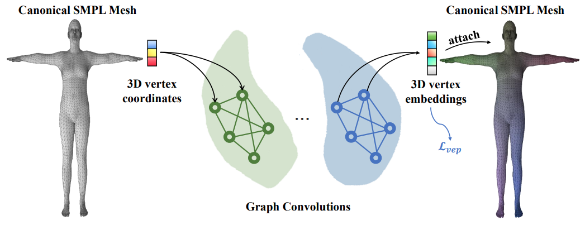

# Structured Distilled 3D Gait Fields (SD-3DGF)

<span style="font-size:20px;">[Under Review at IEEE TCSVT]</span>

   

This repository contains the training data, pretrained checkpoint, PyTorch code implementation of  **Structured Distilled 3D Gait Fields for VCCRe-ID (SD-3DGF)**. 


## News

- [x] Release Pretrained Model Checkpoints 
- [x] Release Dense 2D-3D Paired Training Data
- [x] Release Pytorch Implementation Code
- [x] Release Visualization Code
- [x] Release Data Generation Pipeline
- [x] Release Dense Correspondence Embedding Predictor Training Code
- [ ] Code cleanup and improvements based on feedback
## 1. Features

#### Supported CNN backbones

- `res50`: ResNet-50
- `efficentnet`: EfficientNet-v2
- `effunet`: EfficientUNet
- `unet`: UNet (Standard Version)
- `darknet`: DarkNet-v2
#### Supported ViT backbones
- `dinov2`: DINOv2
- `clip`:  CLIP (ViT Image Encoder)
#### The  Dense Paired Training Data (Approximately 500 GB after decompression), Pedestrian Masks of VCCRe-ID datasets

Our code currently supports the public VCCRe-ID datasets: **VCCR**, **CCVID**,  **CCV-R**, and **CCV-S**.

| Dataset | Num.IDs | Num.Tracklets | Num.Clothes/ID | Public | Raw Data | Dense Paired 2D-3D Data + Masks |
|:----------:|:----------:|:----------:|:----------:|:----------:|:----------:|------------|
| CCV-S | 333 | 9620 | 2~37 | Yes | [link](https://github.com/kkw98/CCVReID) | [link](https://pan.baidu.com/s/1IueBoUibeoHlGNzNR7VkLQ?pwd=hrjt) retrieval code: hrjt |
| CCV-R | 34 | 6948 | 2~10 | Yes | [link](https://github.com/kkw98/CCVReID) | [link](https://pan.baidu.com/s/1HiAgkj-k-Ss9Fx2gJpmHvw?pwd=sfci)  retrieval code: sfci |
| CCVID | 226 | 2856 | 2~5 | Yes | [link](https://drive.google.com/file/d/1vkZxm5v-aBXa_JEi23MMeW4DgisGtS4W/view?usp=sharing) | [link](https://pan.baidu.com/s/1rsx9_DjToV6u0ThP-AHUCg?pwd=yb4g) retrieval code: yb4g |
| VCCR | 392 | 4384 | 2~10 | Yes | [link](https://drive.google.com/file/d/17qJPksE-Fk189KSHTPYQihMfnzXnHC6m/view) | [link](https://pan.baidu.com/s/1kqHXRaAsQ3dQVlf-QuS-TQ?pwd=r59i) retrieval code: r59i |

## 2. Data Preparation
#### First Clone the repository
```bash
git clone https://github.com/yubinwang2021/SD-3DGF
```
#### 2.1 Download the raw datasets listed above and our processed dense 2D–3D paired data.


Create a folder named `data`  and a folder named `checkpoint` inside the repository, 

**2.1.1 For the raw dataset:** 

**(1) [recommended]** You can use our processed data for VCCRe-ID datasets.  You only need to modify the path prefix when reading video frames to point to your local dataset directory.

**(2) [Alternative]** You can process it by yourself by running the following command line (**Note**: replace the path to the folder storing the datasets and the dataset name).

```bash
python datasets/prepare.py --root "your VCCRe-ID Dataset Root" --dataset_name vccr
```
This will generate train.pkl, query.pkl, and gallery.pkl in [dataset_name]. 

**2.1.2 For the dense 2D-3D paired data:** 

**(1) [recommended]** You can use our processed data for VCCRe-ID datasets.

**Data Format Specification**

The tables below describe the data structure of the dense 2D-3D paired data, i.e., two`.pkl` files. Both files are paired with the corresponding input image, sharing the same base filename.

---

**(1-1) `*.pkl` - Visible Vertex Data**
This file stores visible SMPL vertices projected onto the input image. For an input image `CCVID/session1/003_04/00001.jpg`, the corresponding file is `CCVID_session1_003_04_00001.pkl`.

**Data Structure**

- **Type**: Pickle-serialized NumPy array
- **Shape**: `(N, 3)`, where `N` is the number of valid visible vertices
- **Dtype**: `float32`

**Field Description**

| Column Index | Field Name     | Description                                                                 |
|--------------|----------------|-----------------------------------------------------------------------------|
| 0            | x              |  x-coordinate of the vertex in the image coordinate system (origin at the top-left corner) |
| 1            | y              |  y-coordinate of the vertex in the image coordinate system (origin at the top-left corner) |
| 2            | vertex_index   | Original index of the vertex in the SMPL model                    |

---

**(1-2) `*_samples.pkl` - Visible Face Sampling Data**
This file stores sampling points generated on visible triangular faces of the SMPL mesh, along with their corresponding barycentric coordinates. For an input image `CCVID/session1/003_04/00001.jpg`, the corresponding file is `CCVID_session1_003_04_00001_samples.pkl`.

**Data Structure**

- **Type**: Pickle-serialized NumPy array
- **Shape**: `(M, 8)`, where `M` is the total number of sampling points (2 points per visible face by default)
- **Dtype**: `float32`

**Field Description**
| Column Index | Field Name   | Description                                                                 |
|--------------|--------------|-----------------------------------------------------------------------------|
| 0            | sample_x     | x-coordinate of the sampling point (image coordinate system, origin at top-left), stored as float32 |
| 1            | sample_y     | y-coordinate of the sampling point (image coordinate system, origin at top-left), stored as float32 |
| 2            | v0           | Original SMPL index of the 0th vertex of the triangular face containing the sampling point |
| 3            | v1           | Original SMPL index of the 1st vertex of the triangular face containing the sampling point |
| 4            | v2           | Original SMPL index of the 2nd vertex of the triangular face containing the sampling point |
| 5            | b0           | Barycentric coordinate weight corresponding to vertex `v0`                 |
| 6            | b1           | Barycentric coordinate weight corresponding to vertex `v1`                 |
| 7            | b2           | Barycentric coordinate weight corresponding to vertex `v2`                 |

> **Note**: The barycentric coordinates satisfy the constraint `b0 + b1 + b2 = 1`.

**(2) [Alternative]** You can use our data generation pipeline to generate dense 2D-3D paired data for your customized data.

Pytorch Implementation: https://github.com/YubinWang2021/Dense-Paired-Data-Generation 

#### 2.2 Download our pretrained clothes classifier.
| Dataset | Pre-Trained Clothes Classifier|
|:----------:|:----------:|
| CCV-S | [link](https://drive.google.com/file/d/1eXgXnTofXnutDnbCpHszTnJceLwJMZzc/view?usp=sharing) |
| CCV-R | [link](https://drive.google.com/file/d/1Ak5V_u6YmEjjq1wblpttYXEYmVcvB3Wq/view?usp=sharing) |
| CCVID | [link](https://drive.google.com/file/d/1F25i-KjBz3qOIWSFpJQ344UyzQs8pFTL/view?usp=sharing) |
| VCCR | [link](https://drive.google.com/file/d/1klPyXXUjF8VsnUrOCv-ncSS8c1HYmQlU/view?usp=sharing) |

#### 2.3 Download our pretrained 3D vertex embeddings.



Download the pretrained 3D vertex embeddings at  [this link](https://drive.google.com/file/d/1SSYH3zO-ax-aKRHLoaGRsxBQXjXvwAb4/view?usp=sharing).
#### 2.4  Download our pretrained dense embedding correspondence predictor checkpoint or train your own  dense correspondence embedding predictor.
(1) Download our pretrained checkpoint: [this link](https://drive.google.com/file/d/1CbE1WelNSUnP7VCBofmGcHBgbczyruBw/view?usp=sharing). 

(2) For your own customized data, you can refer to our pytorch implementation: https://github.com/YubinWang2021/DCEPredictor  

#### 2.5 Please extract the compressed pretrained data package and organize it according to the directory structure provided below.
**(1) Data Folder:**

```text
Data/
├── VCCR/                  # VCCR dataset
│   ├── dense_corr/        # Dense 2D-3D correspondence
│   ├── mask/              # Segmentation masks
│   ├── train.pkl           # Training split
│   ├── query.pkl           # Query split
│   └── gallery.pkl         # Gallery split
├── CCVID/                 # CCVID dataset
│   ├── dense_corr/
│   ├── mask/
│   ├── train.pkl
│   ├── query.pkl
│   └── gallery.pkl
├── CCV-R/                 # CCV-R dataset
│   ├── dense_corr/
│   ├── mask/
│   ├── train.pkl
│   ├── query.pkl
│   └── gallery.pkl
└── CCV-S/                 # CCV-S dataset
    ├── dense_corr/
    ├── mask/
    ├── train.pkl
    ├── query.pkl
    └── gallery.pkl
```

**(2) Checkpoint Folder:**

```text
checkpoint/
├── vccr_clothes_classifier.pth
├── ccvid_clothes_classifier.pth
├── ccvr_clothes_classifier.pth
├── ccvs_clothes_classifier.pth
└── dce_pretrained.pth
```

## 3. Environment Settings

### Create virtual environment and install the dependencies.

First, create a virtual environment for the repository
```bash
conda create -n sd3dgf python=3.10
```
Second, activate the environment 
```bash
conda activate sd3dgf
```
Next, install the package by running
```bash
python setup.py install
```
Then, install the dependencies
```bash
pip install -r requirements.txt
```

## 4. Configuration Options

Go to `./config.py` to modify configurations accordingly
- Dataset name
- Number of epochs
- Batch size
- Learning rate
- backbone (according to model names above)
- Choice of loss functions
- Hyper-parameters

If training from checkpoint, copy checkpoint path and paste to RESUME in `./config.py`.

## 5. Run Training/Testing Scripts

Create a folder named `work_space` inside the repository, then create two subfolders named `save` and `output`.

```
data
work_space
|--- save
|--- output
main.sh
```
#### Run

```bash
bash main.sh
```

or

```bash
python train.py
python test.py
```

Trained model will be automatically saved to `work_space/save`.

Testing results will be automatically saved to `work_space/output`.

## 6. Visualization


For visualization related code, please refer to the visualization code in the repository:  
https://github.com/YubinWang2021/DCEPredictor  

Upon acceptance of the paper, we will organize and release the full dense correspondence embedding/3D mesh visualization toolkit as a standalone repository in subsequent updates: https://github.com/YubinWang2021/Demo-3D-Vis-Code/

## Citation

The paper is under review at IEEE TCSVT.
- Note
  - All pedestrian video/image data are for research purposes only and must comply with the usage policies of the corresponding open-source datasets.
  
## Acknowledgement
Related Repositories:
-  [CAL](https://github.com/guxinqian/Simple-CCReID)
-  [VCCReID-Baseline](https://github.com/dustin-nguyen-qil/VCCReID-Baseline)


